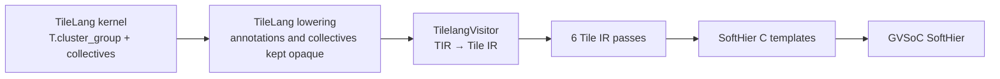

# TileLang for SoftHier

A TileLang extension for **tile-based many-PE accelerators**, where a kernel must also decide which PE owns which tile, how tiles move over the NoC, and where to synchronize. The target is **SoftHier**, a configurable many-cluster RISC-V accelerator modeled in GVSoC.

Semester project at ETH Zürich, Integrated Systems Laboratory (IIS), supervised by Prof. Luca Benini, Dec 2025 – May 2026.

> This repository is a fork of [TileLang](https://github.com/tile-ai/tilelang).

## Problem

A hand-written SoftHier kernel has to map tiles to physical clusters, route broadcasts and reductions over the NoC, and place barriers at group, cluster, and global scope. This code is long and easy to get wrong. TileLang describes computation inside a grid of independent blocks and has no notion of groups of cooperating clusters or of communication between them.

Design principle of this extension: **the kernel author states what is computed and where data lives; the compiler derives cluster placement, collective routing, and synchronization.**

## Results

2D SUMMA GEMM, compiler-generated code vs. hand-written C, on a 4×4-cluster SoftHier configuration (one 4×4 cluster group, BM = BN = BK = 128). N = 7168 and K = 2048 match the down-projection of a DeepSeek-V3 routed expert.

| M    | TileLang (ms) | Hand-written C (ms) | Slowdown |
|------|---------------|---------------------|----------|
| 512  | 1.01          | 0.96                | 5.14%    |
| 4096 | 8.18          | 8.16                | 0.26%    |
| 8192 | 16.66         | 16.64               | 0.11%    |

Geometric-mean slowdown: **1.81%**. The TileLang kernel source is about 1/25 the length of the hand-written C. Runtimes are measured on the GVSoC SoftHier model.

Correctness: the end-to-end GEMM tests (SUMMA, split-K, 2D split-K) compare simulator output against a bit-true golden model, shape by shape.

## Where the code lives

The project spans three repositories:

| Part | Repository | Path |
|------|------------|------|
| DSL frontend (this repo) | [HaozeG/tilelang-softhier](https://github.com/HaozeG/tilelang-softhier) | `tilelang/language/cluster_group.py`, `tilelang/language/collective_op.py`, `src/op/collective_op.cc` |
| Compiler: Tile IR, passes, SoftHier codegen | [HaozeG/Deeploy](https://github.com/HaozeG/Deeploy) (branch `devel`) | `Deeploy/TileIR/`, tests in `DeeployTest/test_tilelang_*.py` |
| Runtime used by the generated code | [HaozeG/gvsoc](https://github.com/HaozeG/gvsoc/tree/softhier_deeploy) (branch `softhier_deeploy`) | `soft_hier/flex_cluster_sdk/runtime/deeploy_include/` |

## Compilation flow



TileLang's own lowering runs unchanged. The new constructs are emitted as `AttrStmt` annotations and opaque intrinsics, so TileLang passes them through untouched and the downstream compiler interprets them.

Tile IR passes, in order:

1. **SoftwarePipelinePass**: turns `T.Pipelined` loops into double-buffered DMA/compute pipelines.
2. **HoistAllocFreePass**: moves loop-invariant L1 alloc/free out of the tile loops.
3. **SpatzVectorizationPass**: rewrites scalar element-wise operations into Spatz vector operations.
4. **GroupAwareBarrierPass**: inserts barriers between operations while respecting cluster-group boundaries.
5. **CollectiveLoweringPass**: lowers collectives to SoftHier NoC primitives, including group initialization and cluster guards.
6. **DedupSyncPass**: collapses runs of redundant intra-cluster synchronizations.

The backend emits bare-metal RISC-V C from 35+ code templates for tile operations and collectives.

## DSL additions

**Cluster groups** (`tilelang/language/cluster_group.py`)

- `T.cluster_group(name, x, y, num_groups, axes, split_axes=..., split_shape=...)` declares a 2D group of clusters as a scheduling scope. `num_groups` instances of the group tile the physical cluster grid. `split_axes` partitions work across instances, for example the K dimension in split-K GEMM. The `with` statement yields the group-instance id and the rank coordinates inside the group.
- `T.tile_layout(buf, axis_map=..., partial=...)` annotates how a tile buffer is sharded across group axes, or marks it as a partial result awaiting reduction.

**Collectives**

- `D.broadcast(buf, level, axis, group, root)` and `D.reduce(buf, op, level, axis, group, root)`, from `Deeploy.TileIR.Frontend.tl_deeploy`. These are the collectives verified end to end.
- Native TileLang intrinsics in this repo: `T.allreduce`, `T.broadcast`, `T.group_shift`, `T.group_bcast_axis`, `T.scatter`, `T.gather`, `T.synchronize`. They are registered as opaque ops and compile, but are not yet verified end to end.

## Example: 2D SUMMA GEMM

```python
import tilelang
import tilelang.language as T
from Deeploy.TileIR.Frontend import tl_deeploy as D

@tilelang.jit
def summa_gemm(A, B, C, BM: int, BN: int, BK: int, GX_: int, GY_: int):
    M, K, N = T.const("M, K, N")
    dtype = T.float16
    A: T.Tensor((M, K), dtype)
    B: T.Tensor((K, N), dtype)
    C: T.Tensor((M, N), dtype)

    with T.Kernel(T.ceildiv(M, GY_ * BM), T.ceildiv(N, GX_ * BN)) as (by, bx):
        with T.cluster_group("summa", x=GX_, y=GY_, num_groups=1,
                             axes=("x", "y")) as (inst_id, local_x, local_y):
            A_local = T.alloc_fragment((BM, BK), dtype)
            B_local = T.alloc_fragment((BK, BN), dtype)
            C_local = T.alloc_fragment((BM, BN), dtype)
            T.clear(C_local)

            for bk in T.Pipelined(T.ceildiv(K, BK), num_stages=2):
                if local_x == local_y:
                    T.copy(A[(by * GY_ + local_y) * BM, bk * BK], A_local)
                    T.copy(B[bk * BK, (bx * GX_ + local_x) * BN], B_local)
                D.broadcast(A_local, level="intra_group", axis="x",
                            group="summa", root=local_y)
                D.broadcast(B_local, level="intra_group", axis="y",
                            group="summa", root=local_x)
                T.gemm(A_local, B_local, C_local, clear_accum=False)

            T.copy(C_local, C[(by * GY_ + local_y) * BM, (bx * GX_ + local_x) * BN])
```

The kernel contains no cluster IDs, NoC addresses, or barriers. The compiler maps group ranks to physical clusters, lowers each broadcast to row or column NoC transfers, and inserts the synchronization.

## Running the tests

```bash
# 1. SoftHier simulator and runtime
git clone -b softhier_deeploy https://github.com/HaozeG/gvsoc.git
cd gvsoc && source sourceme.sh && cd ..
export SOFTHIER_INSTALL_DIR=$PWD/gvsoc

# 2. This repo (TileLang with the SoftHier extensions)
git clone https://github.com/HaozeG/tilelang-softhier.git
pip install -e tilelang-softhier

# 3. Deeploy with the Tile IR compiler
git clone -b devel https://github.com/HaozeG/Deeploy.git
pip install -e Deeploy

# 4. End-to-end tests (compile, simulate on GVSoC, compare against golden)
cd Deeploy/DeeployTest
pytest test_tilelang_gemm.py -v -m "tilelang and softhier" \
  --toolchain=GCC --toolchain-install-dir=$SOFTHIER_INSTALL_DIR/third_party/toolchain/install
```

Most tests in `test_tilelang_cluster_groups.py` are compile-only and need no simulator.

## License

The upstream TileLang code is MIT-licensed; see [LICENSE](LICENSE). Files added for SoftHier carry an Apache-2.0 SPDX header (© ETH Zürich and University of Bologna).
